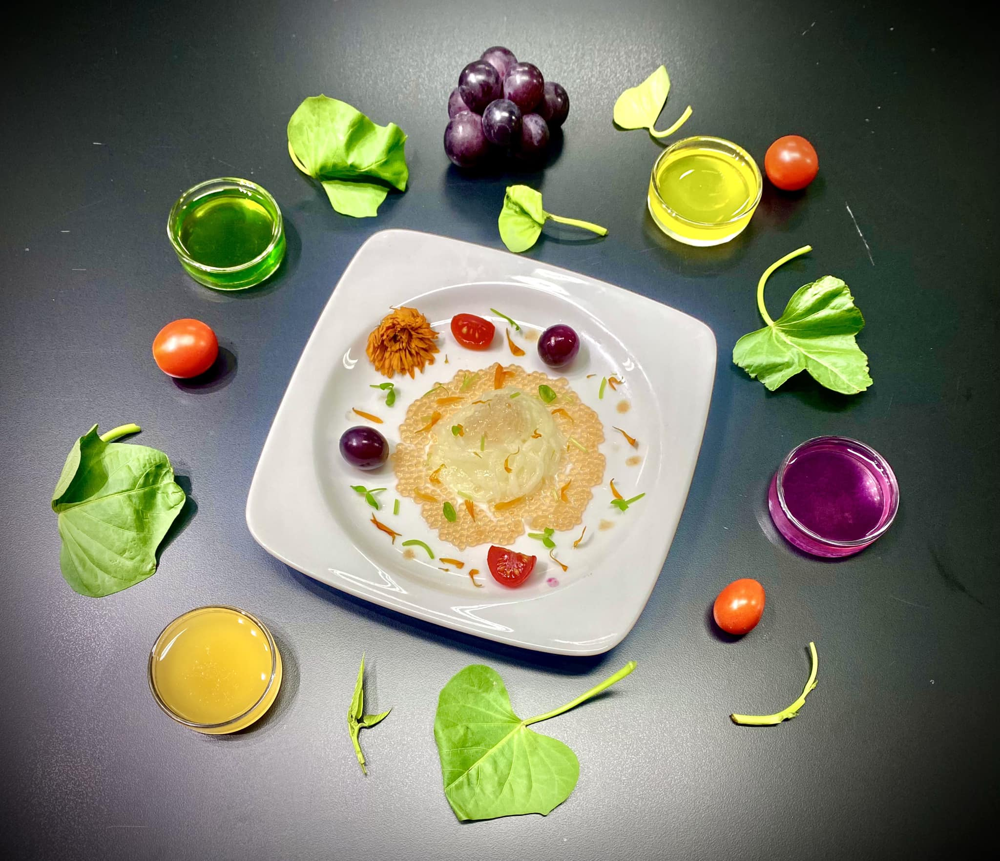

```{r echo=FALSE, out.width = "460px"}
 
```

### Abstract

##### This study examined the correlation between habits of vegetable consumption and acceptance of an innovative dish which incorporated nutrients extracted from fruits and vegetables by using molecular gastronomy technique. A survey of 250 respondents were collected and analyzed in this report. Respondents were further segmented by age, daily vegetable consumption, and vegetable supplement use in this analysis to identify the potential key factors influencing acceptance of the new dish.

##### In this analysis, rates of positive response from different segmentations of respondents ranged from 38.7% to 60.6 %, while rates of negative responses showed a narrower distribution between 10.6% to 24.3%. Results indicated that half of the respondents provided positive feedback for the dish, and daily vegetable consumption was identified as the key factor affecting the acceptance of the new dish. 

### Introduction

##### Consuming sufficient amount of vegetables daily offers numerous health benefits, as they contain nutrients including minerals, vitamins, phytochemicals, and fibers that are essential for improving and maintaining our health. Nevertheless, modern dietary habits have shifted to inadequate consumption of vegetables (Health Promotion Administration, 2022). Given that, a dish containing nutrients extracted from fruits and vegetables was developed aiming to make up for the lack of vegetable nutrients commonly observed among modern population.

##### A survey of 250 participants was conducted to understand the acceptance of the new dish. In this report, analysis of survey results was divided into two parts. In the first part, we examined vegetable eating habits of the respondents. In the second part, correlation between habits of vegetable consumption and acceptance of the new dish was analyzed to identify potential factors affecting the acceptance.

### Part 1: Vegetable consumption analysis

#### 1. Load the required packages

```{r message=FALSE, warning=FALSE}
library(tidyverse)
library(ggrepel)
library(RColorBrewer)
```

#### 2. Load the dataset

```{r}
new_dish_survey <- read.csv("new_dish_survey.csv")
str(new_dish_survey)
```

#### 3. Age distribution of participants

##### Respondents were categorized into five age groups. Split of age groups were based on the ranges defined in Nutrition and Health Survey in Taiwan (Health Promotion Administration, 2022). Age distribution of the participants revealed that "13 to 18" and "65 and above" were the largest groups among the five groups, and "19 to 44" had the smallest sample size. All age groups had sample sizes of at least 30 responses in this analysis. 

```{r warning=FALSE}
age <- as.data.frame(table(new_dish_survey$Age))

age$fraction <- formatC(age$Freq/sum(age$Freq), digits = 3)
age$ymax <- cumsum(age$fraction)
age$ymin <- c(0, head(age$ymax, n = -1))
age$labelPosition <- (age$ymax + age$ymin) / 2
age$label <- paste0(round(age$Freq/sum(age$Freq)*100, 1), "%")

palette_donut <- c("palegreen3", "cornflowerblue", "goldenrod1", "plum3",
                   "lightsalmon2")

theme_donut <-
    theme(plot.title = element_text(size = 18, face = "bold", color = "gray18"),
          legend.position = "right",
          legend.text = element_text(size = 10, color = "gray18"),
          legend.key.size = unit(0.8, 'cm'),
          legend.title = element_blank())

ggplot(age, aes(ymax = ymax, ymin = ymin, xmax = 4, xmin = 3, fill = Var1)) +
  geom_rect(color = "white", linewidth = 1) +
  ggtitle("Age distribution of participants") +
  geom_label(x = 3.5, aes(y = labelPosition, label = label), size = 3.5, 
             label.size = 0, color = "white", fill = "transparent",
             fontface = "bold") +
  theme_void() +
  coord_polar(theta = "y") +
  scale_fill_manual(values = palette_donut) +
  theme_donut + theme(plot.title = element_text(hjust = 1.5)) +
  xlim(2, 4)
```

```{r fig.height=6, fig.width=7, warning=FALSE}
theme_bar <-
  theme(plot.title = element_text(size = 18, face = "bold", color = "gray18", 
                                  hjust = 0.35, vjust = 10),
        axis.title.x = element_blank(), 
        axis.title.y = element_blank(),
        axis.text.x = element_text(size = 8, color="gray58"),
        axis.text.y = element_text(size = 10.5, color="gray36"))

ggplot(age, aes(x = Var1, y = Freq)) +
  geom_col(position = position_dodge(width = 1), width = .75, fill = "skyblue3") +
  theme_minimal() +
  theme(aspect.ratio = 1/1.5) +
  ggtitle("Age distribution of participants") +
  theme_bar +
  geom_text(aes(label = age$Freq, y = age$Freq/2), color = "white", 
            size = 3.8, fontface = "bold") +
  scale_y_continuous(breaks = seq(0, max(age$Freq), by = 10), expand = c(0, 0)) +
  coord_flip()
```

#### 4. Daily vegetable consumption

##### It is recommended by the Ministry of Health and Welfare to consume at least three portions of vegetables daily for good health, with one portion roughly equivalent to half of a bowl of cooked vegetables (Ministry of Health and Welfare, 2018). In spite of that, survey results revealed only 9.2% of the respondents met the recommended daily vegetable consumption. Over 90% did not consume sufficient vegetables everyday.

```{r fig.height=5, fig.width=7, warning=FALSE}
veg_por <- as.data.frame(table(new_dish_survey$Daily_vegetable_consumption))
veg_por$Var1 <- factor(veg_por$Var1, 
                       levels = c("Less than 1", "1 to 2", "2 to 3", 
                                  "3 to 4", "More than 4")) 
veg_por$fraction <- formatC(veg_por$Freq/sum(veg_por$Freq), digits = 3)

theme_point_bar <-
  theme(plot.title = element_text(size = 18, face = "bold", 
                                  color = "gray18", hjust = 0.25, vjust = 14),
        axis.title.x = element_text(size = 12.5, vjust = -5),
        axis.title.y = element_blank(), 
        axis.text.x = element_blank(),
        axis.text.y = element_text(size = 11.5, color="gray36"),
        panel.grid = element_blank(),
        strip.text = element_text(size = 12, color = "gray18", vjust = 2.7),
        aspect.ratio = 1/2.5)

ggplot(veg_por, aes(x = forcats::fct_rev(Var1), y = fraction)) +
  ggtitle("Daily vegetable consumption (portion)") +
  geom_point(aes(color = ifelse(veg_por$Var1 %in% c("3 to 4", "More than 4"), 
                                "palegreen3", "darksalmon")), size = 12.5) +
  scale_color_identity() +
  geom_col(fill = ifelse(veg_por$Var1 %in% c("3 to 4", "More than 4"), 
                         "palegreen3", "darksalmon"), width = .45) +
  scale_fill_identity() +
  geom_text(aes(label = round(veg_por$Freq/sum(veg_por$Freq), 3) * 100), 
            color = "white", size = 3.5, fontface = "bold") +
  theme_minimal() +
  theme_point_bar +
  ylab("Percentage (%)") +
  geom_vline(xintercept = 2.5, color = "indianred", linetype = "dashed", 
             linewidth = 1) +
  coord_flip()
```

##### Analysis of daily vegetable consumption by age group indicated that, percentages of respondents meeting recommended daily vegetable consumption were higher in "12 and below" and "13 to 18" age groups, which were 12.5% and 11.3% respectively. One possible reason behind higher percetages in these groups is the requirement for school lunch to include at least 1.5 to 2 portions of vegetables in each meal (Ministry of Health and Welfare, 2020). Percentages of "19 to 44", "45 to 64", and "65 and above" age groups consuming at least 3 portions of vegetables daily were less than 10%, which were 8.1%, 9.8%, and 5.0% respectively.   

```{r fig.height=9, fig.width=9, warning=FALSE}
veg_por_age <- new_dish_survey %>%
  select(Age, Daily_vegetable_consumption) %>%
  group_by(Age, Daily_vegetable_consumption) %>%
  count() %>%
  ungroup() %>%
  group_by(Age) %>%
  mutate(sub_total = sum(n)) %>%
  mutate(Percentage = round(n / sub_total, 3) * 100) %>%
  ungroup()
veg_por_age$Daily_vegetable_consumption <-
  factor(veg_por_age$Daily_vegetable_consumption,
         levels = c("Less than 1", "1 to 2", "2 to 3", "3 to 4", "More than 4"))

ggplot(veg_por_age, aes(x = forcats::fct_rev(Daily_vegetable_consumption), 
                        y = Percentage)) +
  ggtitle("Daily vegetable consumption (portion) by age group") +
  geom_point(aes(color = ifelse(veg_por_age$Daily_vegetable_consumption %in% 
                                c("3 to 4", "More than 4"), 
                                "palegreen3", "darksalmon")), 
             size = 9.5) +
  scale_color_identity() +
  geom_col(fill = ifelse(veg_por_age$Daily_vegetable_consumption %in% 
                         c("3 to 4", "More than 4"), 
                         "palegreen3", "darksalmon"), 
           width = .55) +
  scale_fill_identity() +
  geom_text(aes(label = Percentage), color = "white", size = 3.2, 
            fontface = "bold") +
  ylab("Percentage (%)") +
  theme_minimal() +
  theme_point_bar +
  geom_vline(xintercept = 2.5, color = "indianred", linetype = 3, 
             linewidth = .5) +
  coord_flip() +
  facet_wrap(~Age, nrow = 3)
```

#### 5. Frequency of consumption of dark vegetables 

##### In addition to consuming sufficient amount of vegetables, eating different colors of dark vegetables offers a range of nutrients and antioxidants that are beneficial to health. For example, it is recommended to contain at least 1/2 to 2/3 portion of dark vegetables in school lunch (Ministry of Health and Welfare, 2020), including vegetables in dark green, yellow, purple, and red. 

##### Survey results revealed that when consuming vegetables, 54.8% responded that they "Often" or "Always" incorporate dark vegetables. This result indicated that even though most respondents had insufficient vegetable intake, over half of them still frequently choose dark vegetables when they eat vegetables. 

```{r fig.height=5, fig.width=7, warning=FALSE}
dark_veg_freq <- as.data.frame(table(new_dish_survey$Dark_vegetable_frequency))
dark_veg_freq$fraction <- formatC(dark_veg_freq$Freq/sum(dark_veg_freq$Freq),
                                  digits = 3)
dark_veg_freq$Var1 <- factor(dark_veg_freq$Var1, 
                             levels = c("Never", "Rarely", "Sometimes", 
                                        "Often", "Always"))

ggplot(dark_veg_freq, aes(x = forcats::fct_rev(Var1), y = fraction)) +
  ggtitle("Frequency of consuming dark vegetables") +
  geom_point(aes(color = ifelse(dark_veg_freq$Var1 %in% c("Often", "Always"), 
                                "palegreen3", "darksalmon")), size = 12.5) +
  scale_color_identity() +
  geom_col(fill = ifelse(dark_veg_freq$Var1 %in% c("Often", "Always"), 
                         "palegreen3", "darksalmon"), width = .45) +
  scale_fill_identity() +
  geom_text(aes(label = round(dark_veg_freq$Freq/sum(dark_veg_freq$Freq), 
                              3) * 100), 
            color = "white", size = 3.5, fontface = "bold") +
  theme_minimal() +
  theme_point_bar +
  ylab("Percentage (%)") +
  geom_vline(xintercept = 2.5, color = "indianred", linetype = "dashed", 
             linewidth = 1) +
  coord_flip()
```

#### 6. Vegetable supplement use

##### Furthermore, it is quite common in Taiwan to take nutritional supplements, such as probiotics and vitamins to promote health. The market size of nutritional supplements in Taiwan is growing in recent year, particularily after the COVID-19 pandemic (International Trade Administration, 2023). However, the popularity is relatively lower for vegetable nutrient supplement use. Survey results revealed that only 15.6% responded that they "Often" or "Always" take vegetable supplements, while 61.2% responded that they "Rarely" or "Never" use them, even under the circumstance that most people lack of these nutrients due to insufficient vegetable consumption. 

```{r}
veg_sup_use <- as.data.frame(table(new_dish_survey$Vegetable_supplement_use))
veg_sup_use$Var1 <- factor(veg_sup_use$Var1,
                           levels = c("Never", "Rarely", "Sometimes", 
                                      "Often", "Always"))
veg_sup_use <- veg_sup_use %>%
  arrange(desc(Var1))

veg_sup_use$fraction <- formatC(veg_sup_use$Freq/sum(veg_sup_use$Freq),
                                digits = 3)
veg_sup_use$ymax <- cumsum(veg_sup_use$fraction)
veg_sup_use$ymin <- c(0, head(veg_sup_use$ymax, n = -1))
veg_sup_use$labelPosition <- (veg_sup_use$ymax + veg_sup_use$ymin) / 2
veg_sup_use$label <- 
  paste0(round(veg_sup_use$Freq/sum(veg_sup_use$Freq) * 100, 1), "%")

ggplot(veg_sup_use, aes(ymax = ymax, ymin = ymin, xmax = 4, xmin = 3, 
                        fill = Var1)) +
  geom_rect(color = "white", linewidth = 1) +
  ggtitle("Vegetable supplement use") +
  geom_label(x=3.5, aes(y = labelPosition, label = label), size = 3.5, 
             label.size = 0, color = "gray30", fill = "transparent") +
  theme_void() +
  coord_polar(theta = "y") +
  scale_fill_brewer(palette = "Pastel1") +
  theme_donut + theme(plot.title = element_text(hjust = 1)) +
  xlim(2, 4)
```

### Part 2: New dish acceptance analysis

#### 1. New dish acceptance overall

##### In the survey results regarding acceptance of the new dish from 250 participants, 50.8% of them provided positive responses (i.e., "Probably" or "Definitely" try the new dish), while 15.6% provided negative responses (i.e., "Probably not" or "Definitely not" try).

```{r warning=FALSE}
acceptance <- as.data.frame(table(new_dish_survey$New_dish_acceptance))
acceptance$Var1 <- 
  factor(acceptance$Var1, levels = c("Definitely not", "Probably not", 
                                     "Neutral", "Probably", "Definitely"))
acceptance <- acceptance %>%
  arrange(desc(Var1))

acceptance$fraction <- formatC(acceptance$Freq/sum(acceptance$Freq), digits = 3)
acceptance$ymax <- cumsum(acceptance$fraction)
acceptance$ymin <- c(0, head(acceptance$ymax, n = -1))
acceptance$labelPosition <- (acceptance$ymax + acceptance$ymin) / 2
acceptance$label <- 
  paste0(round(acceptance$Freq/sum(acceptance$Freq) * 100, 1), "%")

ggplot(acceptance, aes(ymax = ymax, ymin = ymin, xmax = 4, xmin = 3, 
                       fill = Var1)) +
  geom_rect(color = "white", linewidth = 1) +
  ggtitle("New dish acceptance") +
  geom_label(x=3.5, aes(y = labelPosition, label = label), size = 3.5, 
             label.size = 0, color = "gray30", fill = "transparent") +
  theme_void() +
  coord_polar(theta = "y") +
  scale_fill_brewer(palette = "Pastel1") +
  theme_donut + theme(plot.title = element_text(hjust = 1)) +
  xlim(2, 4)
```

#### 2. New dish acceptance by age group

##### Analysis of acceptance of respondents segmented by age group revealed that, ages of respondents within "19 to 44" and "65 and above" groups had the highest rates of positive responses, which were 59.4% and 58.3% respectively. Rate of positive response of "13 to 18" was 38.7%, which was the lowest among the five groups. In "12 and under" and "45 to 64" age groups, around half of the respondents provided positive responses for trying the new dish.

##### Regarding the negative responses, rate of "65 and above" was 20.0%, which was the highest among all age groups. The second highest was 17.6% from "45 to 64" age group. Rates of negative responses from the rest age groups were within 12-14%. 

```{r fig.height=13.5, fig.width=7}
new_dish_survey_acceptance <- new_dish_survey
new_dish_survey_acceptance$New_dish_acceptance <- 
  factor(new_dish_survey_acceptance$New_dish_acceptance, 
         levels = c("Definitely not", "Probably not", "Neutral", 
                    "Probably", "Definitely"))

acceptance_by_age <- new_dish_survey_acceptance %>%
  select(Age, New_dish_acceptance) %>%
  group_by(Age, New_dish_acceptance) %>%
  count() %>%
  ungroup() %>%
  group_by(Age) %>%
  mutate(sub_total = sum(n),
         Percentage = round(n / sub_total, 3) * 100,
         ymax = cumsum(Percentage),
         ymin = c(0, head(ymax, n = -1)),
         labelPosition = (ymax + ymin) / 2,
         label = paste0(Percentage, "%"))

theme_donut_wrap <- 
  theme(plot.title = element_text(size = 18, face = "bold", color = "gray18", 
                                  hjust = 0.5, vjust = 16),
        legend.position = "bottom",
        legend.text = element_text(size = 10, color = "gray18"),
        legend.key.size = unit(0.8, 'cm'),
        legend.title = element_blank(),
        strip.text = element_text(size = 12, color = "gray18"))

geom_label_donut_wrap <- 
  geom_label(x=3.5, aes(y = labelPosition, label = label), size = 3.3, 
             label.size = 0, color = "gray30", fill = "transparent")

ggplot(acceptance_by_age, aes(ymax = ymax, ymin = ymin, xmax = 4, xmin = 3, 
                              fill = New_dish_acceptance)) +
  geom_rect(color = "white", linewidth = 1) +
  ggtitle("New dish acceptance by age group") +
  geom_label_donut_wrap +
  theme_void() +
  coord_polar(theta = "y") +
  scale_fill_brewer(palette = "Pastel1") +
  theme_donut_wrap +
  xlim(2, 4) +
  facet_wrap(~Age, nrow = 3)
```

##### Comparison between different groups revealed a positive correlation between rates of negative responses and age, which could be due to that the younger generations were more open to new food types, while food preferences developed as people age could be increasingly challenging to change due to deeply ingrained eating habits. No significant correlation was observed between rates of positive responses and age.

```{r}
positive_by_age <- acceptance_by_age %>%
  select(Age, New_dish_acceptance, Percentage) %>%
  group_by(Age) %>%
  filter(New_dish_acceptance %in% c("Probably", "Definitely")) %>%
  summarize(sum = sum(Percentage)) %>%
  select(sum)
negative_by_age <- acceptance_by_age %>%
  select(Age, New_dish_acceptance, Percentage) %>%
  group_by(Age) %>%
  filter(New_dish_acceptance %in% c("Probably not", "Definitely not")) %>%
  summarize(sum = sum(Percentage)) %>%
  select(sum) 
age_group <- c("12 and under", "13 to 18", "19 to 44", "45 to 64", 
               "65 and above")

positive_by_age_df <- 
  list(age_group = age_group, value = positive_by_age, group = "Positive") %>% 
  as.data.frame()
negative_by_age_df <- 
  list(age_group = age_group, value = negative_by_age, group = "Negative") %>% 
  as.data.frame()
acceptance_by_age_line <- rbind(positive_by_age_df, negative_by_age_df) 
acceptance_by_age_line$age_group <- 
  factor(acceptance_by_age_line$age_group, 
         levels = c("12 and under", "13 to 18", "19 to 44", "45 to 64", 
                    "65 and above"))
acceptance_by_age_line$group <- 
  factor(acceptance_by_age_line$group, levels = c("Positive", "Negative"))

theme_line <-
  theme(plot.title = element_text(size = 18, face = "bold", color = "gray18"),
        legend.position = "bottom",
        legend.text = element_text(size = 10, color = "gray18"),
        legend.title = element_blank(),
        axis.title.x = element_blank(), 
        axis.title.y = element_blank(),
        axis.text.x = element_text(size = 10, color="gray30"),
        axis.text.y = element_text(size = 7.5, color="gray58"))

geom_text_repel_line <-
  geom_text_repel(aes(label = paste0(sum, "%")), 
                  nudge_y = 3, size = 3.5, col = "gray50") 

ggplot(acceptance_by_age_line, aes(x = age_group, y = sum, group = group, 
                                   col = group)) +
  geom_point(size = 3) +
  geom_line(linewidth = 1.5) +
  theme_minimal() +
  ggtitle("Correlation between acceptance and age group") +
  scale_color_manual(values = c("#00BFC4", "#F8766D")) +
  geom_text_repel_line +  
  theme_line + theme(plot.title = element_text(hjust = 0.5, vjust = 2.1))
```

##### It is noteworthy that 48.4% of "13 to 18" age group responded they are "Neutral" to try the new dish, which means nearly half of respondents within this group could be lack of opinion or ambivalence, or need more details to decide. The developer of the new dish may want to use alternative approaches to further understand the preference of this age group. 

#### 3. New dish acceptance by daily vegetable consumption

##### In the analysis of acceptance of respondents segmented by daily vegetable consumption, respondents that consumed "Less than 1" or "1 to 2" protions of vegetables daily had comparatively lower percentages of positive responses, which were 43.2% and 46.8% respectively. Percentages of negative responses were 24.3% and 16.9% from these two groups, which were comparatively higher among the five groups. In the group that consumes "2 to 3" portions of vegetable daily, percentage of positive response was 60.6%, and was 10.6% for the negative response, which demonstrated higher acceptance of the new dish when comparing with groups that consumed less vegetables everyday. 

##### As for the respondents meeting the recommended portion of daily vegetable consumption (i.e., participants responded "3 to 4" and "More than 4" portions), over half of them were positive to try the new dish. However, under the context that most people do not consume enough vegetables (e.g., only 9.2% in this survey), sample sizes of these two groups were both less than 30. Therefore, results from "3 to 4" and "More than 4" groups were excluded in the analysis. 

```{r fig.height=13.5, fig.width=7}
acceptance_by_veg <- new_dish_survey_acceptance %>%
  select(Daily_vegetable_consumption, New_dish_acceptance) %>%
  group_by(Daily_vegetable_consumption, New_dish_acceptance) %>%
  count() %>%
  ungroup() %>%
  group_by(Daily_vegetable_consumption) %>%
  mutate(sub_total = sum(n),
         Percentage = round(n / sub_total, 3) * 100,
         ymax = cumsum(Percentage),
         ymin = c(0, head(ymax, n = -1)),
         labelPosition = (ymax + ymin) / 2,
         label = paste0(Percentage, "%"))

acceptance_by_veg$Daily_vegetable_consumption <-
  factor(acceptance_by_veg$Daily_vegetable_consumption, 
         levels = c("Less than 1", "1 to 2", "2 to 3", "3 to 4", "More than 4"))

ggplot(acceptance_by_veg, aes(ymax = ymax, ymin = ymin, xmax = 4, xmin = 3, 
                              fill = New_dish_acceptance)) +
  geom_rect(color = "white", linewidth = 1) +
  ggtitle("New dish acceptance by daily vegetable \n consumption (portion)") +
  geom_label_donut_wrap +
  theme_void() +
  coord_polar(theta = "y") +
  scale_fill_brewer(palette = "Pastel2") +
  theme_donut_wrap +
  xlim(2, 4) +
  facet_wrap(~Daily_vegetable_consumption, nrow = 3)
```

##### Among the three groups having samlpe sizes more than 30, positive correlation was observed between rates of positive responses and daily vegetable consumption, and negative correlation was observed between rates of negative responses and daily vegetable consumption. In other words, respondents consuming less vegetables daily were not only less likely to try the new dish, but they were also more likely to reject it. The results indicated that daily vegetable consumption can serve as one of the potential key factors influencing acceptance of the new dish.

```{r}
positive_by_veg <- acceptance_by_veg %>%
  select(Daily_vegetable_consumption, New_dish_acceptance, Percentage) %>%
  group_by(Daily_vegetable_consumption) %>%
  filter(New_dish_acceptance %in% c("Probably", "Definitely")) %>%
  summarize(sum = sum(Percentage)) %>%
  select(sum) %>%
  head(3)
negative_by_veg <- acceptance_by_veg %>%
  select(Daily_vegetable_consumption, New_dish_acceptance, Percentage) %>%
  group_by(Daily_vegetable_consumption) %>%
  filter(New_dish_acceptance %in% c("Probably not", "Definitely not")) %>%
  summarize(sum = sum(Percentage)) %>%
  select(sum) %>%
  head(3)
veg_consump <- c("Less than 1", "1 to 2", "2 to 3")

positive_by_veg_df <- 
  list(veg_consump = veg_consump, value = positive_by_veg, group = "Positive") %>% 
  as.data.frame()
negative_by_veg_df <- 
  list(veg_consump = veg_consump, value = negative_by_veg, group = "Negative") %>% 
  as.data.frame()
acceptance_by_veg_line <- rbind(positive_by_veg_df, negative_by_veg_df) 
acceptance_by_veg_line$veg_consump <- 
  factor(acceptance_by_veg_line$veg_consump, 
         levels = c("Less than 1", "1 to 2", "2 to 3"))
acceptance_by_veg_line$group <- 
  factor(acceptance_by_veg_line$group, levels = c("Positive", "Negative"))

ggplot(acceptance_by_veg_line, aes(x = veg_consump, y = sum, group = group, 
                                   col = group)) +
  geom_point(size = 3) +
  geom_line(linewidth = 1.5) +
  theme_minimal() +
  ggtitle("Correlation between acceptance and \n vegetable consumption") +
  scale_color_manual(values = c("#00BFC4", "#F8766D")) +
  geom_text_repel_line +  
  theme_line + theme(plot.title = element_text(hjust = 0.5, vjust = 2.2))
```

#### 4. New dish acceptance by vegetable supplement use

##### Analysis of acceptance of respondents segmented by vegetable supplement use indicated that, rates of positive responses of survey participants that responded "Never", "Rarely", and "Sometimes" were 39.6%, 56.2%, and 44.8% respectively. Rates of negative responses from these three groups were 18.8%, 13.4%, and 18.9% respectively. These results revealed that rate of acceptance was the highest from those who "Rarely" take vegetable supplements.

##### Results from the groups "Often" and "Always" in frequencies of vegetable supplement use were excluded in the analysis, as sample sizes were both less than 30 from these two groups. 

```{r fig.height=13.5, fig.width=7}
acceptance_by_sup <- new_dish_survey_acceptance %>%
  select(Vegetable_supplement_use, New_dish_acceptance) %>%
  group_by(Vegetable_supplement_use, New_dish_acceptance) %>%
  count() %>%
  ungroup() %>%
  group_by(Vegetable_supplement_use) %>%
  mutate(sub_total = sum(n),
         Percentage = round(n / sub_total, 3) * 100,
         ymax = cumsum(Percentage),
         ymin = c(0, head(ymax, n = -1)),
         labelPosition = (ymax + ymin) / 2,
         label = paste0(Percentage, "%"))

acceptance_by_sup$Vegetable_supplement_use <-
  factor(acceptance_by_sup$Vegetable_supplement_use,
         levels = c("Never", "Rarely", "Sometimes", "Often", "Always"))

ggplot(acceptance_by_sup, aes(ymax = ymax, ymin = ymin, xmax = 4, xmin = 3, 
                              fill = New_dish_acceptance)) +
  geom_rect(color = "white", linewidth = 1) +
  ggtitle("New dish acceptance by vegetable supplement use") +
  geom_label_donut_wrap +
  theme_void() +
  coord_polar(theta = "y") +
  scale_fill_brewer(palette = "Pastel2") +
  theme_donut_wrap +
  xlim(2, 4) +
  facet_wrap(~Vegetable_supplement_use, nrow = 3)
```

##### Among the three groups with large enough sample sizes, no significant correlation between rates of acceptance and vegetable supplement use was observed. Based on the analysis, frequencies of vegetable supplement use did not significantly influence acceptance of the new dish. 

```{r}
positive_by_sup <- acceptance_by_sup %>%
  select(Vegetable_supplement_use, New_dish_acceptance, Percentage) %>%
  group_by(Vegetable_supplement_use) %>%
  filter(New_dish_acceptance %in% c("Probably", "Definitely")) %>%
  summarize(sum = sum(Percentage)) %>%
  select(sum) %>%
  head(3)
negative_by_sup <- acceptance_by_sup %>%
  select(Vegetable_supplement_use, New_dish_acceptance, Percentage) %>%
  group_by(Vegetable_supplement_use) %>%
  filter(New_dish_acceptance %in% c("Probably not", "Definitely not")) %>%
  summarize(sum = sum(Percentage)) %>%
  select(sum) %>%
  head(3)
sup_use <- c("Never", "Rarely", "Sometimes")

positive_by_sup_df <- 
  list(sup_use = sup_use, value = positive_by_sup, group = "Positive") %>% 
  as.data.frame()
negative_by_sup_df <- 
  list(sup_use = sup_use, value = negative_by_sup, group = "Negative") %>% 
  as.data.frame()
acceptance_by_sup_line <- rbind(positive_by_sup_df, negative_by_sup_df) 
acceptance_by_sup_line$sup_use <- 
  factor(acceptance_by_sup_line$sup_use, 
         levels = c("Never", "Rarely", "Sometimes"))
acceptance_by_sup_line$group <- 
  factor(acceptance_by_sup_line$group, levels = c("Positive", "Negative"))

ggplot(acceptance_by_sup_line, aes(x = sup_use, y = sum, group = group, 
                                   col = group)) +
  geom_point(size = 3) +
  geom_line(linewidth = 1.5) +
  theme_minimal() +
  ggtitle("Correlation between acceptance and vegetable \n supplement use") +
  scale_color_manual(values = c("#00BFC4", "#F8766D")) +
  geom_text_repel_line +  
  theme_line + theme(plot.title = element_text(hjust = 0.5, vjust = 2.2))
```

### Conclusion

##### Vegetables contain various nutrients that are crucial for our health. While Taiwan has a variety of vegetables commonly available in the market, analysis in this report revealed that over 90% of respondents do not consume enough vegetables everyday, which is consistent with the study released by Ministry of Health and Welfare in 2022.

##### Although it is popular in Taiwan to take nutritional supplements, only 15.6% of respondents frequently take supplements for vegetables, and 61.2% responded they rarely or never use them, which is quite high considering that most of respondents do not meet the recommended daily vegetable consumption. This results indicate an unmet need for supplementing vegetable nutrition due to imbalanced diet.

##### An innovative dish containing fruit and vegetable nutrients is developed to target this demand. In a survey of 250 participants, the levels of acceptance vary depending on different segmentation approaches, namely by age, average amount of daily vegetable consumption, and frequency of vegetable supplement use. Daily vegetable consumption is identified as the key factor influencing the rates of acceptance in this report. 

##### In general, over half of respondents are willing to try the new dish. With further improvement by tailoring the design of the dish to the target group segmented by key influencing factor, this dish can potentially become the preferred choice of the target segment to make up for insufficient vegetable consumption.

### Reference

##### Health Promotion Administration, R.O.C., 2022. Nutrition and Health Survey in Taiwan. Available at: https://www.hpa.gov.tw/Pages/List.aspx?nodeid=3998

##### Ministry of Health and Welfare, R.O.C., 2018. Dietary Guideline. Available at: https://www.hpa.gov.tw/Pages/EBook.aspx?nodeid=1208

##### Ministry of Health and Welfare, R.O.C., 2020. School Lunch Contents and Nutrition Guideline. Available at: https://www.hpa.gov.tw/Pages/ashx/File.ashx?FilePath=~/File/Attach/731/File_16593.pdf

##### International Trade Administration, 2023. Taiwan Dietary Supplements Market. Available at: https://www.trade.gov/market-intelligence/taiwan-dietary-supplements-market
